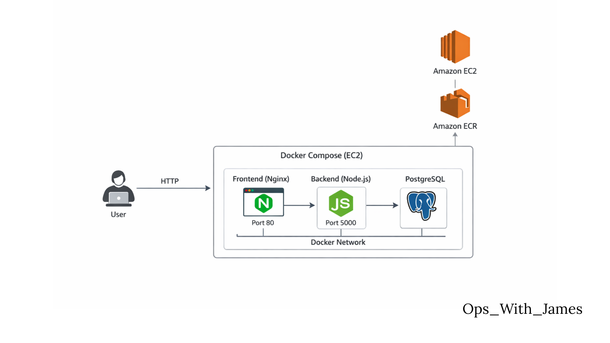

# 🛤️ Jerney — Blog Platform

A Gen-Z vibe blog platform built with a 3-tier architecture — React frontend, Node.js backend, and PostgreSQL database.


---
## 👨‍💻 What I Did

This project was originally started by Abhishek Veeramalla (application code + basic setup).

I took it further by focusing on the DevOps side of things:

- Containerized the application using Docker
- Pushed images to AWS ECR
- Deployed the app on AWS EC2 using Docker Compose
- Implemented environment separation using `.env` files
- Added logging and debugged real issues (networking, DB connection)
- Fixed service communication using Docker networking

This repo reflects my work on making the application run in a more production-like environment.

## ✨ Features

- 📝 Create blog posts with emoji vibes
- ✏️ Edit your existing posts
- 🗑️ Delete posts you're not feeling anymore
- 💬 Comment on posts
- 🎨 Gen-Z dark UI with glassmorphism and gradients

## 🏗️ Architecture

User → Application Entry Point
A user (browser) sends an HTTP request
The request goes to your EC2 instance
Specifically, it hits the Frontend (Nginx) on port 80

👉 This is the public entry point of your system

 EC2 Instance (Your Server)
Everything is hosted inside one EC2 machine
You are not using Kubernetes or multiple servers yet
Instead, you're using Docker Compose to manage services

👉 Think of EC2 as your “mini data center”

 Docker Compose (Core of the System)

Inside EC2, Docker Compose runs 3 containers/services:

🟢 Frontend (Nginx)
Runs on port 80
Serves your UI (React, HTML, etc.)
Also acts as a reverse proxy
Sends API requests to backend

👉 Flow:
User → Nginx → Backend

🟢 Backend (Node.js API)
Runs on port 5000
Handles business logic
Processes requests from frontend

👉 Flow:
Frontend → Backend

🟢 Database (PostgreSQL)
Stores application data
Only accessible internally (not exposed publicly)

👉 Flow:
Backend → PostgreSQL

 Docker Network
All 3 services are connected via a private Docker network
They communicate using service names (not IPs)

👉 Example:

Backend connects to DB using postgres:5432
Amazon ECR (Container Registry)
Stores your Docker images
EC2 pulls images from ECR before running them

👉 Flow:
ECR → EC2 → Docker Compose runs containers

Full Request Flow (End-to-End)

Here’s the complete journey:

User opens your app in browser
Request hits Nginx (port 80)
Nginx forwards API request → Node.js backend (port 5000)
Backend queries → PostgreSQL database
Response flows back the same way

👉 Final:
User ← Nginx ← Backend ← Database


## 🚀 Run This Project (Docker - Recommended)

### Prerequisites

- Docker installed
- Docker Compose installed
- AWS CLI installed and configured (for ECR access)

---

### 🧩 Setup & Run (Step-by-step)

```bash
# 1. Clone the repository
git clone https://github.com/JamesDevops1/Jerney.git
cd Jerney

# 2. Create environment file
cat <<EOF > .env.prod
NODE_ENV=production
DB_HOST=db
DB_USER=jereny
DB_PASSWORD=password
DB_NAME=jereny_db
PORT=5000
EOF

# 3. Login to AWS ECR
aws ecr get-login-password --region us-east-1 | \
docker login --username AWS --password-stdin <your-account-id>.dkr.ecr.us-east-1.amazonaws.com

# 4. Start the application
docker-compose up -d

# 5. Check running containers
docker ps

# 6. View backend logs (optional)
docker logs -f jerney-backend
